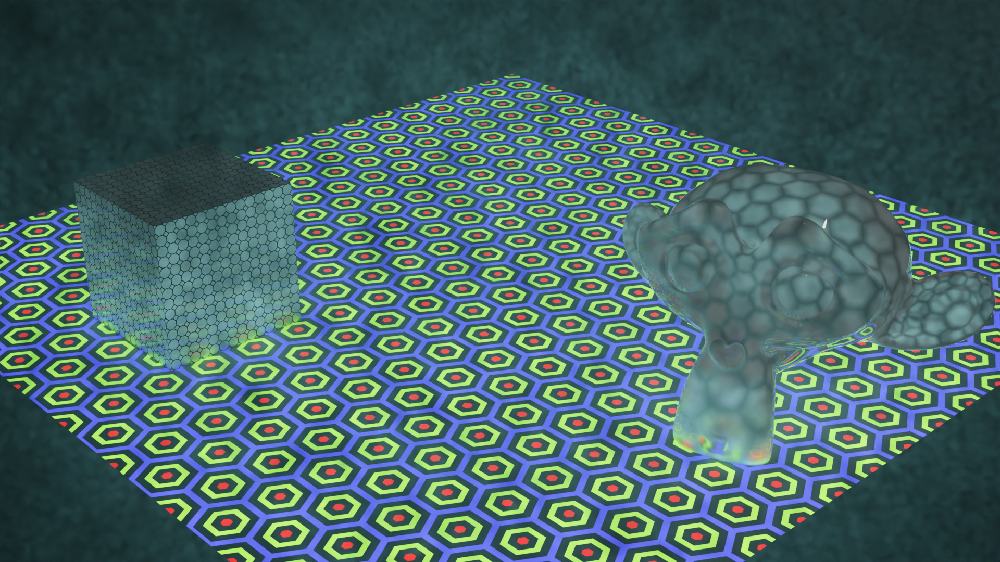

# Shaders en OSL
<a href="README.en.md">English</a>

Aquí voy a ir subiendo shaders escritos en Open Shading language.

Como actualmente Blender no permite utilizarlos con renderizado con la GPU, añadiré versiones hechas con los nodos de materiales de Blender dentro de la carpeta NodeVersion (Esto permite utilizarlos también en Eevee).

En la <a href="./wiki">wiki</a> del repositorio iré añadiendo los cálculos necesarios para crear cada shader.